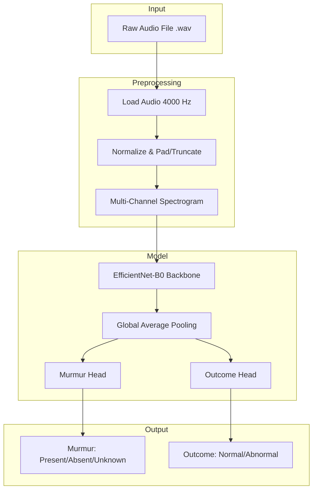

# Project Overview: Jivascope - Heart Sound Classification

## Project Summary

**Jivascope** is a machine learning system for automated heart sound analysis using the CirCor DigiScope Phonocardiogram Dataset. The system performs two classification tasks:

1. **Murmur Detection**: Classifies heart sounds as `Present`, `Absent`, or `Unknown` (3-class)
2. **Clinical Outcome Prediction**: Predicts `Normal` or `Abnormal` outcome (binary)

**Target Accuracy**: 95%+

---

## Architecture Diagram

---

## Step Sequence & Dependencies

---

## Implementation Steps Summary

| Step | Name | Description | Estimated Time |
|------|------|-------------|----------------|
| 1 | [Environment & EDA](file:///d:/Programming/Projects/tunir_daa/Jivascope/project_implementation_plan/02_step_01_environment_and_eda.md) | Set up environment, explore dataset | 5-7 hours |
| 2 | [Data Preprocessing](file:///d:/Programming/Projects/tunir_daa/Jivascope/project_implementation_plan/03_step_02_data_preprocessing.md) | Build data pipeline, PyTorch datasets | 1-2 days |
| 3 | [Model Architecture](file:///d:/Programming/Projects/tunir_daa/Jivascope/project_implementation_plan/04_step_03_model_architecture.md) | Design multi-task CNN model | 4-6 hours |
| 4 | [Training Pipeline](file:///d:/Programming/Projects/tunir_daa/Jivascope/project_implementation_plan/05_step_04_training_pipeline.md) | Implement training loop, losses, metrics | 1-2 days |
| 5 | [Training & Optimization](file:///d:/Programming/Projects/tunir_daa/Jivascope/project_implementation_plan/06_step_05_training_and_optimization.md) | Train model, tune hyperparameters | 1-3 days |
| 6 | [Inference & Evaluation](file:///d:/Programming/Projects/tunir_daa/Jivascope/project_implementation_plan/07_step_06_inference_and_evaluation.md) | Create inference API, evaluate on test set | 6-9 hours |
| 7 | [API Integration](file:///d:/Programming/Projects/tunir_daa/Jivascope/project_implementation_plan/08_step_07_api_integration.md) | FastAPI deployment (future) | 4-6 hours |

**Total Estimated Time**: 7-12 days

---

## Technology Stack

| Component | Technology |
|-----------|------------|
| Language | Python 3.10+ |
| Deep Learning | PyTorch |
| Audio Processing | librosa, torchaudio |
| Model Backbone | EfficientNet-B0 (pretrained) |
| Training | Google Colab Pro (GPU) |
| API (Future) | FastAPI |

---

## Key Design Decisions

### 1. Multi-Channel Spectrogram Approach
- **Chosen**: Mel spectrogram + Delta + Delta-Delta (3 channels)
- **Rationale**: Research shows ~99% accuracy on CirCor with combined time-frequency representations
- **Alternative considered**: Raw waveform with 1D CNN (simpler but lower accuracy)

### 2. Pretrained Backbone
- **Chosen**: EfficientNet-B0 (pretrained on ImageNet)
- **Rationale**: Transfer learning from large visual dataset improves generalization
- **Trade-off**: Requires converting audio to image-like spectrograms

### 3. Multi-Task Learning
- **Chosen**: Single backbone with two classification heads
- **Rationale**: Murmur and Outcome are related; shared features improve both tasks
- **Alternative**: Two separate models (more parameters, longer training)

### 4. Segmentation-Free Inference
- **Chosen**: CNN learns to classify without explicit S1/S2 segmentation
- **Rationale**: Simpler inference (audio-only input), research shows CNN can learn boundaries
- **Note**: TSV segmentation can be used during training for augmentation

---

## Verification Plan

### Automated Tests

1. **Unit Tests** (Optional)
   - Test audio preprocessing pipeline
   - Test model forward pass dimensions
   - Test data augmentation outputs

2. **Integration Tests**
   - End-to-end test: load audio → preprocess → predict → validate output format
   
### Model Validation

1. **Validation Set Metrics** (during training)
   - Murmur accuracy ≥ 95%
   - Outcome accuracy ≥ 95%
   - Monitor overfitting via loss curves

2. **Test Set Evaluation** (final)
   - Held-out 15% of patients
   - Report precision, recall, F1 per class
   - Confusion matrix visualization

### Manual Verification

1. **Sample Predictions**
   - Test on 5-10 random audio files
   - Compare predictions with ground truth labels

2. **Edge Cases**
   - Very short audio files
   - Noisy recordings
   - Recordings with unusual characteristics

---

## Risk Assessment

| Risk | Mitigation |
|------|------------|
| Class imbalance | Focal loss, weighted sampling |
| Overfitting | Dropout, data augmentation, early stopping |
| GPU memory limits | Reduce batch size, gradient accumulation |
| <95% accuracy | Ensemble models, hyperparameter tuning, deeper backbone |

---

## Success Criteria

- [ ] Murmur detection accuracy ≥ 95% on test set
- [ ] Clinical outcome accuracy ≥ 95% on test set
- [ ] Inference works with audio-only input (no TSV required)
- [ ] Model checkpoint saved and loadable
- [ ] Demo notebook showing end-to-end usage
